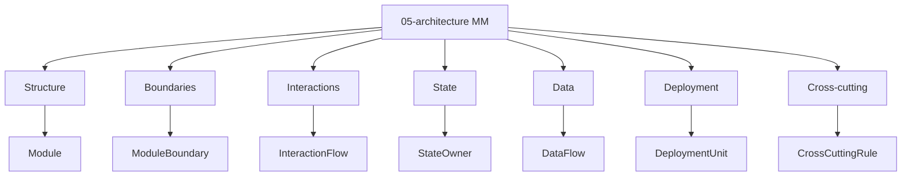

# Type View — Modular Monolith / 05-architecture

Status: **reading view**.

Source pack: [05-architecture pack](../../../packs/variants/modular-monolith/05-architecture/README.md). Active contract: `docs/meta/01-entity-types/05-architecture/`.

## Baseline Type View

Danh sách stable type template thuộc [05-architecture base](../../../packs/variants/modular-monolith/05-architecture/README.md). `docs/meta/01-entity-types/05-architecture/` là owner active duy nhất của contract local.

Quan hệ canonical: [interaction-map.md](interaction-map.md).
