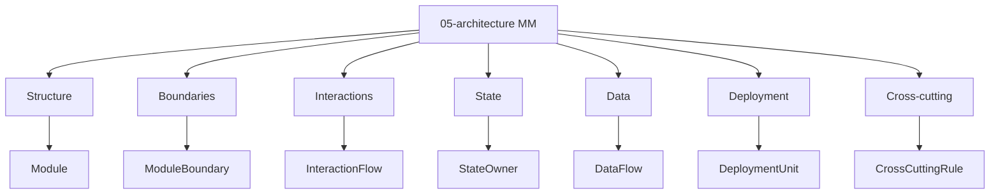

# Common Promoted Types — Modular Monolith / 05-architecture

Status: **canonical common subset**.

Derived from: `docs/meta/01-entity-types/05-architecture/`, [folder-structure.md](../../../../folder-structure.md) § 05-architecture.

## Common promoted types

| Concern (05) | Entity types |
| --- | --- |
| Structure | Module |
| Boundaries | ModuleBoundary |
| Interactions | InteractionFlow |
| State | StateOwner |
| Data | DataFlow |
| Deployment | DeploymentUnit |
| Cross-cutting | CrossCuttingRule |

Định nghĩa canonical: `docs/meta/01-entity-types/05-architecture/`.

Quan hệ canonical: [interaction-map.md](interaction-map.md).

## Variant candidate taxonomy

`docs/app_variants/custom_modular_monolith/05-architecture/` có candidate types chi tiết hơn như `ModuleGroup`, `ImportBoundary`, `ReadModel`, `RawEventRecord`, `ApplicationRuntime` và các rule/boundary chuyên biệt.

Các type đó **không** được ngầm coi là canonical hoặc nằm trong graph file này. Chúng chỉ được promote vào meta sau khi meaning, relation slots và valid triples được chốt.
