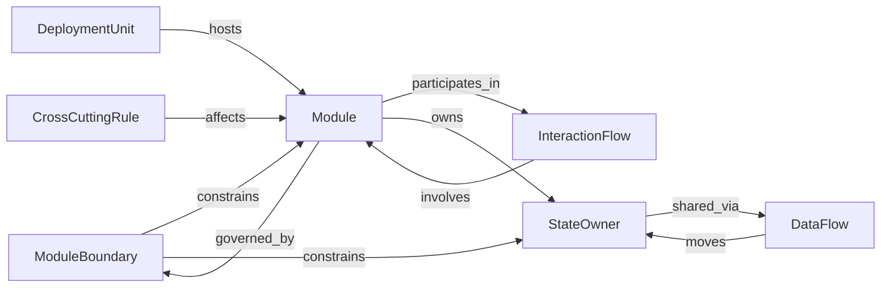

# Interaction Map — Modular Monolith / 05-architecture

Reading view cho relation template của biến thể modular monolith ở layer `05-architecture`. Không phải source pack hoặc canonical graph của một project.

Source template: [modular-monolith 05-architecture base](../../../packs/variants/modular-monolith/05-architecture/README.md). Active canonical graph thuộc `docs/meta/` của từng project.

## Graph

## Ghi Chú

- Diagram chỉ mô tả stable relation template của base.
- Variant khác = pack + interaction-map khác dưới layer tương ứng.
- Triple list canonical của project thuộc `docs/meta/03-rules/05-architecture/valid-triples.md`.
