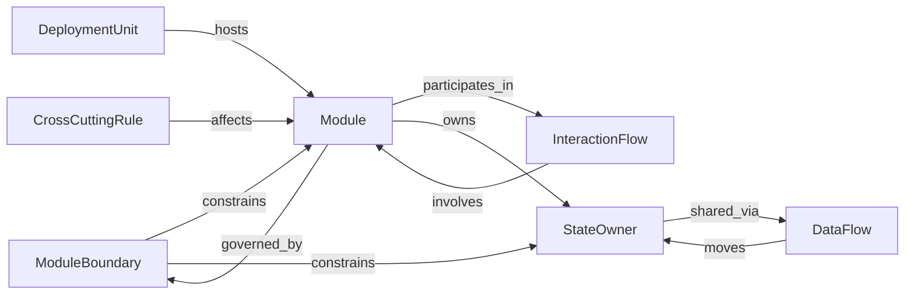

# Interaction Map — Modular Monolith / 05-architecture

Quan hệ **trong** biến thể modular monolith ở layer `05-architecture`. Không phải map architecture portable chung.

Derived from (khi có): `docs/meta/03-rules/05-architecture/valid-triples.md`.

## Graph

## Triple list

| Source | Relation | Target |
| --- | --- | --- |
| Module | `governed_by` | ModuleBoundary |
| ModuleBoundary | `constrains` | Module |
| ModuleBoundary | `constrains` | StateOwner |
| Module | `participates_in` | InteractionFlow |
| InteractionFlow | `involves` | Module |
| Module | `owns` | StateOwner |
| StateOwner | `shared_via` | DataFlow |
| DataFlow | `moves` | StateOwner |
| DeploymentUnit | `hosts` | Module |
| CrossCuttingRule | `affects` | Module |

## Ghi chú

- Dual còn mở có thể theo dõi ở `docs/review/review.md`.
- Variant khác = pack + interaction-map khác dưới layer tương ứng.
